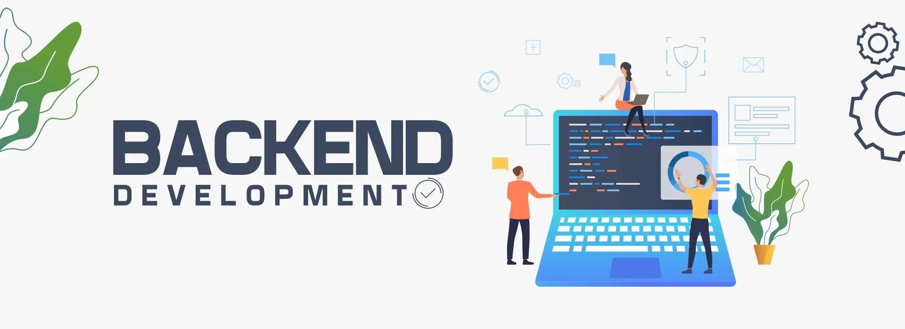

# Backend Development Branch

Welcome to the backend development branch of My health in your hands

## Overview
This branch is dedicated to the ongoing development of the backend components of our project. It serves as a workspace where developers can collaborate on backend-specific features, improvements, and bug fixes. By isolating backend development from the master branch, we ensure a stable production environment on the master branch while allowing for the continuous evolution of the backend functionality.

## Purpose
- Feature Development:
 New backend features and functionalities are implemented and tested here before being merged into the master branch for production 
